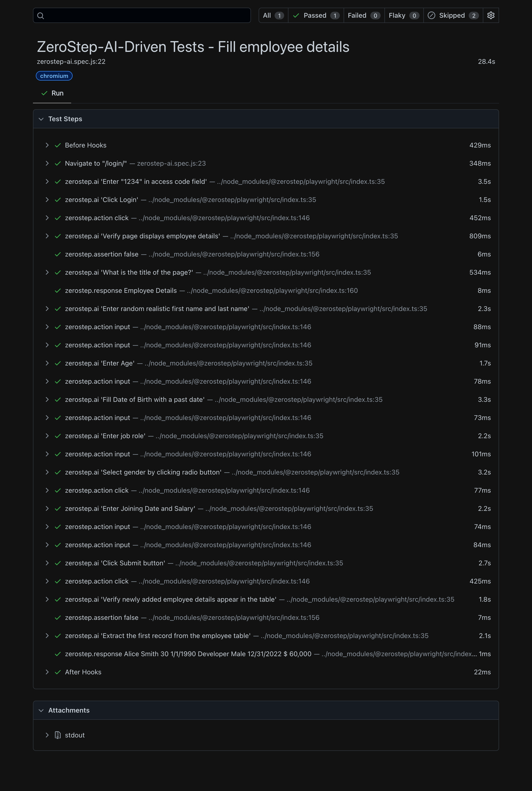

# 🤖 ZeroStep AI + Playwright Integration  
*AI-powered test automation with natural language instructions*

---

## Test Result 

## 📘 Overview

**ZeroStep AI** enhances your **Playwright** tests using AI-based natural language commands.  
No selectors, no brittle locators — simply describe what you want your test to do.

---

## 🚀 Installation

npm install @zerostep/playwright -D

---

## 🔐 Authentication Setup

Store your token securely (get it from [ZeroStep app dashboard](https://app.zerostep.com)).

**Option 1: via Environment Variable**

export ZEROSTEP_TOKEN="<your_token_here>"

**Option 2: via Config File**

Create a `zerostep.config.json` file in your project root:

{
"TOKEN": "<your_token_here>"
}

---

## 🧠 Example Test

import { test } from '@playwright/test';
import { ai } from '@zerostep/playwright';

test('AI-assisted Google search', async ({ page }) => {
await page.goto('https://google.com');
const aiArgs = { page, test };

await ai('Type "Playwright AI integration" in the search box', aiArgs);
await ai('Press Enter', aiArgs);
});

---

## ⚙️ Optional: Use AI Fixture (Clean Syntax)

/ ai-fixture.ts
import { test as base } from '@playwright/test';
import { aiFixture, type AiFixture } from '@zerostep/playwright';

export const test = base.extend<AiFixture>({
...aiFixture(base),
});

/ ai-fixture.ts
import { test as base } from '@playwright/test';
import { aiFixture, type AiFixture } from '@zerostep/playwright';

export const test = base.extend<AiFixture>({
...aiFixture(base),
});

import { test } from './ai-fixture';

test('AI search simplified', async ({ page }) => {
await page.goto('https://zerostep.com/');
await ai('Get the header text');
});

---

## 🧩 Features

- Natural language-driven test steps  
- Works across browsers and devices  
- Robust selector-free automation  
- Integrates easily with existing Playwright setup  

---

## 🧪 Run Tests

npx playwright test

For UI mode:

npx playwright test --ui

---

## 📊 Project Resources

| Resource | Link |
|-----------|------|
| Official Website | [zerostep.com](https://zerostep.com) |
| GitHub Repo | [ZeroStep AI](https://github.com/zerostep-ai/zerostep) |
| Blog | [AI in Playwright Testing](https://www.thetesttribe.com/blog/playwright-tests-with-ai) |

---

## 📄 License

This project follows the [MIT License](LICENSE).

_Developed with ❤️ using [ZeroStep AI](https://zerostep.com)_

